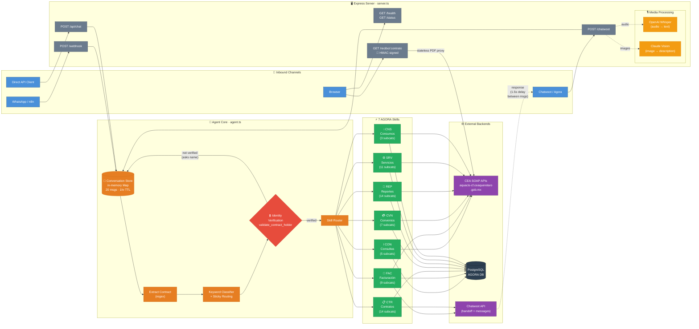

# Maria Claude — Complete System Map

Two complementary Mermaid diagrams that visualize the entire Maria Claude system: a WhatsApp-based AI agent for CEA Queretaro (water utility) customer service.

- **Diagram 1** — End-to-end message flow from inbound channels through the agent core to external backends
- **Diagram 2** — Skill-to-tool-to-backend matrix showing all 7 AGORA skills, 63 subcategories, 10 tools, and 3 backends

---

## 1. System Architecture Flow

How messages flow through the system: inbound channels → Express server → agent core → skills → backends.

---

## 2. Skill → Tool → Backend Matrix

Every skill with its subcategories, which tools it invokes, and what backends those tools hit.

```mermaid
flowchart TB
    subgraph SKILLS["MARIA CLAUDE — 7 AGORA Skills · 63 Subcategories"]
        direction LR

        subgraph S_CON["ℹ️ CON · Consultas"]
            CON_LIST["CON-001 Info general\nCON-002 Saldo/adeudo\nCON-003 Horarios oficinas\nCON-004 Requisitos trámites\nCON-005 Estatus solicitud"]
        end

        subgraph S_FAC["📄 FAC · Facturación"]
            FAC_LIST["FAC-001 Recibo por correo\nFAC-002 Recibo a domicilio\nFAC-003 Reimpresión recibo\nFAC-004 Aclaración cobro\nFAC-005 Solicitud ajuste\nFAC-006 Carta no adeudo\nFAC-007 Historial pagos\nFAC-008 Devolución pago\nFAC-009 Multas"]
        end

        subgraph S_CTR["📋 CTR · Contratos"]
            CTR_LIST["CTR-001 Toma nueva doméstica\nCTR-002 Toma nueva comercial\nCTR-003 Fraccionamiento\nCTR-004 Cambio titular\nCTR-005 Datos fiscales\nCTR-006 Cambio tarifa\nCTR-007 Incremento unidades\nCTR-008 Domiciliación pago\nCTR-009 Baja temporal\nCTR-010 Baja definitiva\nCTR-011 Condominios\nCTR-012 Individualización\nCTR-013 Grandes consumidores\nCTR-014 Piperos"]
        end

        subgraph S_CVN["💳 CVN · Convenios"]
            CVN_LIST["CVN-001 Corto plazo 0-6m\nCVN-002 Mediano plazo 7-12m\nCVN-003 Largo plazo 13+m\nCVN-004 Prórroga\nCVN-005 Pensionados\nCVN-006 Tercera edad\nCVN-007 Discapacidad"]
        end

        subgraph S_REP["🔧 REP · Reportes"]
            REP_LIST["Fugas: FVP FTD FRD FDR\nServicio: FSA FSD BAP\nCalidad: ATB AOL ASB\nOtros: MED DRO TAP HUN"]
        end

        subgraph S_SRV["⚙️ SRV · Servicios Técnicos"]
            SRV_LIST["SRV-001 Reportar lectura\nSRV-002 Revisión medidor\nSRV-003 Medidor invertido\nSRV-004 Reposición medidor\nSRV-005 Relocalización medidor\nSRV-006 Reposición suministro\nSRV-007 Alcantarillado\nSRV-008 Instalación toma\nSRV-009 Relocalización toma\nSRV-010 Revisión instalación\nSRV-011 Fuga no visible"]
        end

        subgraph S_CNS["💧 CNS · Consumos"]
            CNS_LIST["CNS-001 Historial consumo\nCNS-002 Consumo por año\nCNS-003 Tendencia"]
        end
    end

    subgraph TOOLS["🔧 10 Tools"]
        direction LR
        T_DEUDA(["get_deuda\n💰 Saldo"])
        T_CONSUMO(["get_consumo\n📊 Historial"])
        T_CONTRACT(["get_contract_details\n📋 Contrato"])
        T_SEARCH(["search_customer\n🔍 Contacto"])
        T_CREATE(["create_ticket\n🎫 Crear reporte"])
        T_TICKETS(["get_client_tickets\n📑 Ver reportes"])
        T_UPDATE(["update_ticket\n✏️ Modificar"])
        T_VALIDATE(["validate_holder\n🔒 Verificar nombre"])
        T_RECIBO(["get_recibo_pdf\n📄 Recibo PDF"])
        T_HANDOFF(["handoff_to_human\n👤 Transferir"])
    end

    subgraph BACK["🌐 Backends"]
        direction LR
        B_SOAP["CEA SOAP APIs\nDeuda · Consumo · Contratos · PDFs"]
        B_PG[("PostgreSQL / AGORA\nTickets · Contactos")]
        B_CW["Chatwoot API\nHandoff · Mensajes"]
    end

    %% CON → Tools
    S_CON --> T_DEUDA
    S_CON --> T_CONTRACT
    S_CON --> T_TICKETS
    S_CON --> T_SEARCH
    S_CON --> T_VALIDATE

    %% FAC → Tools
    S_FAC --> T_DEUDA
    S_FAC --> T_CONSUMO
    S_FAC --> T_CONTRACT
    S_FAC --> T_CREATE
    S_FAC --> T_SEARCH
    S_FAC --> T_RECIBO
    S_FAC --> T_VALIDATE
    S_FAC --> T_HANDOFF

    %% CTR → Tools
    S_CTR --> T_CONTRACT
    S_CTR --> T_SEARCH
    S_CTR --> T_CREATE
    S_CTR --> T_HANDOFF

    %% CVN → Tools
    S_CVN --> T_DEUDA
    S_CVN --> T_CONTRACT
    S_CVN --> T_CREATE
    S_CVN --> T_SEARCH

    %% REP → Tools
    S_REP --> T_CREATE
    S_REP --> T_CONTRACT
    S_REP --> T_VALIDATE

    %% SRV → Tools
    S_SRV --> T_CONSUMO
    S_SRV --> T_CONTRACT
    S_SRV --> T_CREATE
    S_SRV --> T_SEARCH

    %% CNS → Tools
    S_CNS --> T_CONSUMO
    S_CNS --> T_CONTRACT
    S_CNS --> T_DEUDA
    S_CNS --> T_CREATE
    S_CNS --> T_VALIDATE

    %% Tools → Backends
    T_DEUDA --> B_SOAP
    T_CONSUMO --> B_SOAP
    T_CONTRACT --> B_SOAP
    T_RECIBO --> B_SOAP
    T_VALIDATE --> B_SOAP
    T_CREATE --> B_PG
    T_TICKETS --> B_PG
    T_UPDATE --> B_PG
    T_SEARCH --> B_PG
    T_HANDOFF --> B_CW

    %% Styling
    classDef con fill:#3498DB,stroke:#2471A3,color:white
    classDef fac fill:#E67E22,stroke:#CA6F1E,color:white
    classDef ctr fill:#2ECC71,stroke:#27AE60,color:white
    classDef cvn fill:#9B59B6,stroke:#7D3C98,color:white
    classDef rep fill:#E74C3C,stroke:#CB4335,color:white
    classDef srv fill:#F39C12,stroke:#D68910,color:white
    classDef cns fill:#1ABC9C,stroke:#17A589,color:white
    classDef tool fill:#ECF0F1,stroke:#BDC3C7,color:#2C3E50
    classDef soap fill:#2C3E50,stroke:#1A252F,color:white
    classDef db fill:#27AE60,stroke:#1E8449,color:white
    classDef cwapi fill:#8E44AD,stroke:#6C3483,color:white

    class S_CON,CON_LIST con
    class S_FAC,FAC_LIST fac
    class S_CTR,CTR_LIST ctr
    class S_CVN,CVN_LIST cvn
    class S_REP,REP_LIST rep
    class S_SRV,SRV_LIST srv
    class S_CNS,CNS_LIST cns
    class T_DEUDA,T_CONSUMO,T_CONTRACT,T_SEARCH,T_CREATE,T_TICKETS,T_UPDATE,T_VALIDATE,T_RECIBO,T_HANDOFF tool
    class B_SOAP soap
    class B_PG db
    class B_CW cwapi
```

